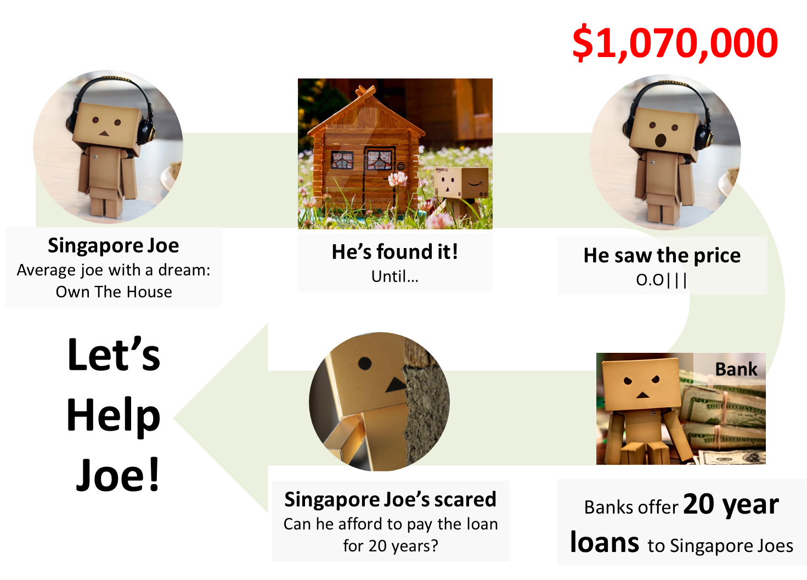

## Singapore Joe has a problem 

</img>

--- .class #id 

## Bank Home Loans & SIBOR*

```{r echo=FALSE, fig.width=14, fig.height=3}
library(ggplot2)
   ggplot(sibor, aes(x=Date, y=X1.mth)) + xlab('Months & Years') + ylab('1-month Sibor Value') + geom_line(colour="red", size=1) + scale_colour_hue(h=c(0, 90)) + guides(fill=FALSE)

```
<h2 style='text-align: center'>
Bank loan rates are pegged to volatile SIBOR
</h2>
<h4 style='text-align: center'><br><br>
What if we helped Singapore Joe <b>predict SIBOR for his loan</b>?
</h4>

<br><br><br><br>
<p style='font-style: italic; font-size=1px'>* SIBOR = Singapore Interbank Offer Rates</p>

--- .class #id 

## The SIBOR Forecaster (1 Month Rates)
<div style='text-align: center'>The tool that helps Singapore Joe answer the question: 
<br><br>
"Can he afford to pay the loan for 20 years?"
</div>
<br>
</img>

--- .class #id 

## Now Joe Knows 
<div style='text-align: center;'>
</img>
</div>
<p style='text-align: center'>
That he can afford his home!
<br>
You can too @
<br>
<a href="https://skybe077.shinyapps.io/proj/">https://skybe077.shinyapps.io/proj/</a>
</p>
